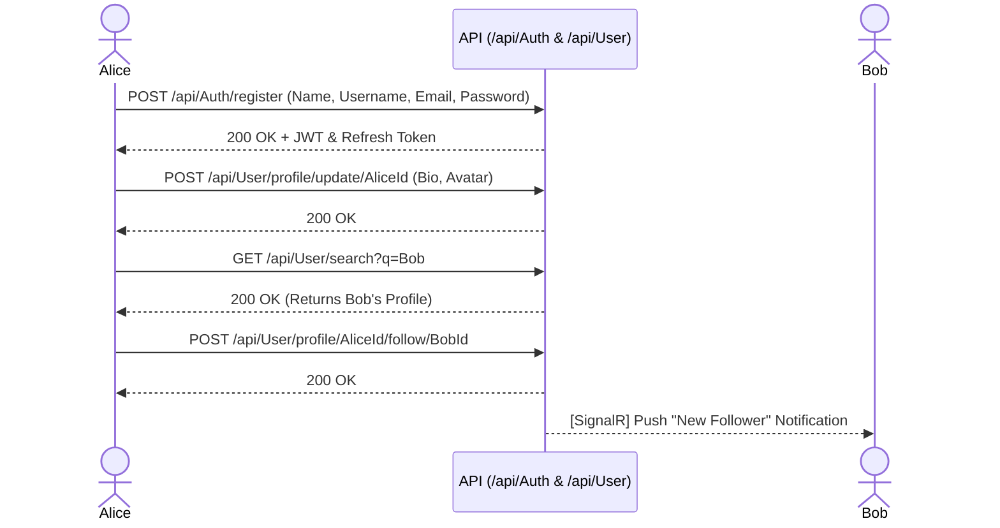
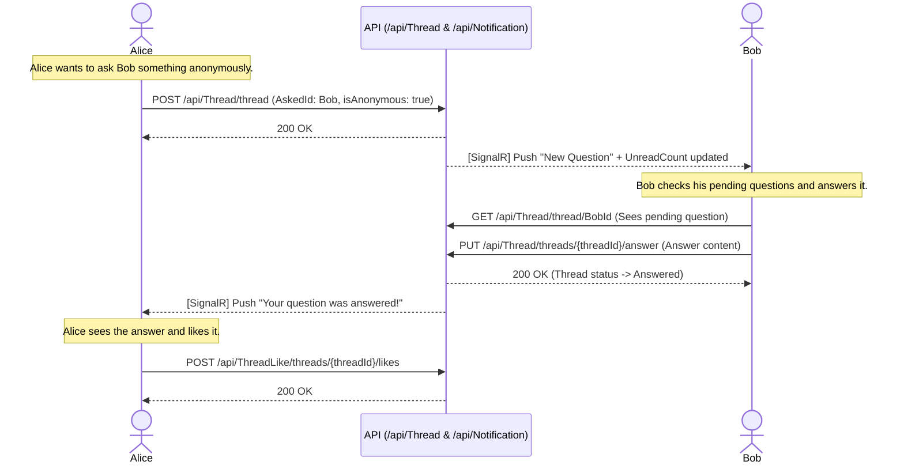
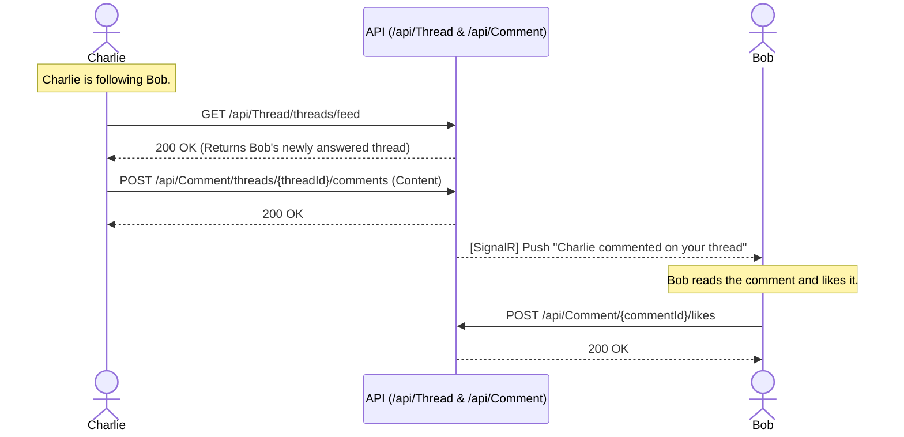
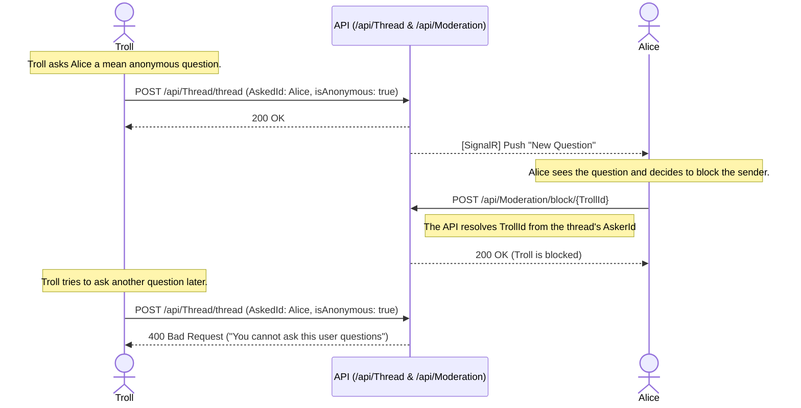
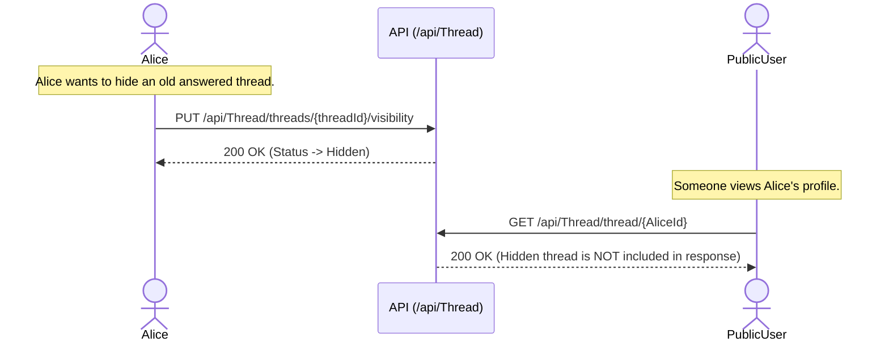

# AskFm User Flows

This document outlines common end-to-end user journeys within the AskFm backend, demonstrating how the various endpoints and real-time features interact.

---

## Flow 1: Onboarding and Social Discovery

This flow illustrates a new user joining the platform, setting up their profile, finding friends, and establishing a social connection.

---

## Flow 2: The Anonymous Q&A Lifecycle

This is the core loop of the platform: asking a question anonymously, the recipient answering it, and the original asker engaging with the answer.

---

## Flow 3: Feed and Commenting

Users have a personalized feed consisting of answered questions from people they follow. They can interact by leaving comments.

---

## Flow 4: Moderation and Abuse Handling

Because anonymity can lead to spam or harassment, users can easily block people who send them abusive questions, even if the sender is anonymous.

---

## Flow 5: Managing Profile Visibility

Sometimes a user answers a question but later decides they don't want it visible on their public profile anymore without completely deleting it.

